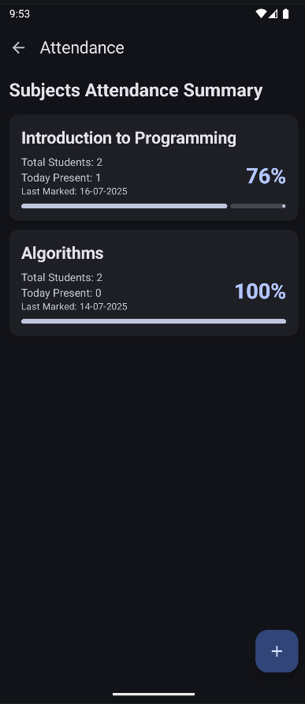
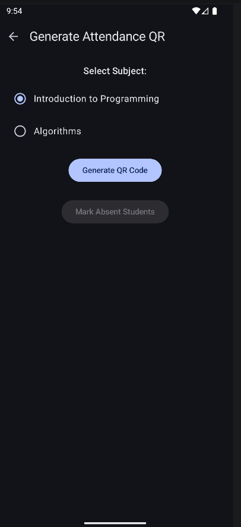
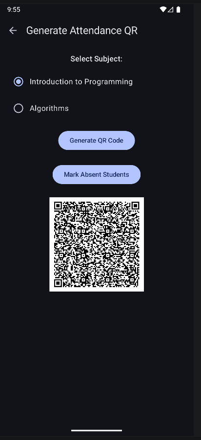
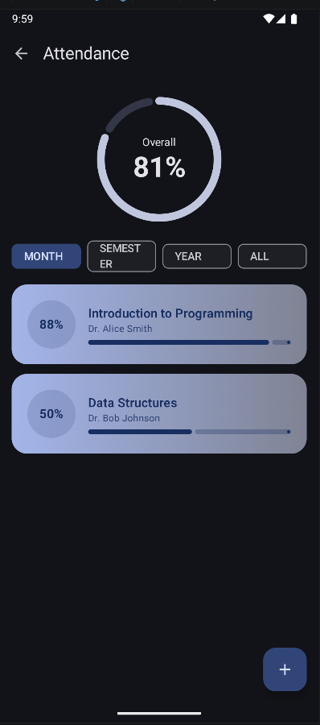
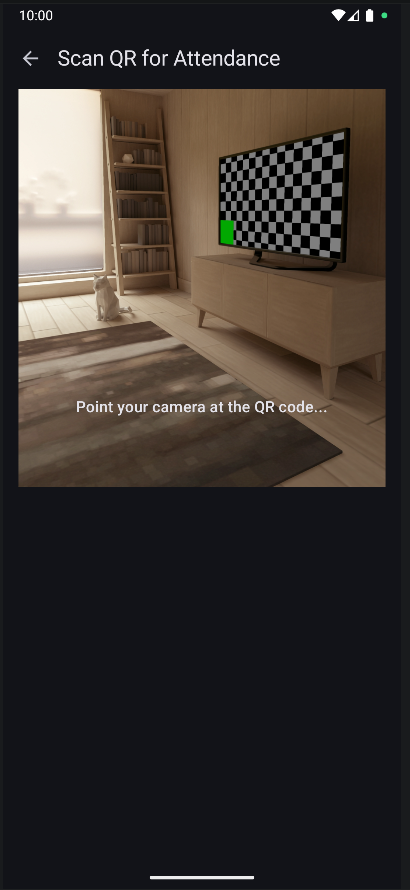

# Campus Sync - Smart Attendance System

🚀 **Overview**  
Campus Sync is a modern, QR code-based attendance management system designed for educational institutions. The app streamlines attendance tracking by enabling teachers to generate dynamic QR codes that students scan to mark their presence, eliminating manual roll calls. A key feature is the automatic regeneration of QR codes every 10 minutes, ensuring they are time-sensitive and preventing misuse across multiple class sessions. Teachers can also mark absent students in bulk for efficiency.

This project showcases a full-stack solution with a native Android frontend and a Spring-based backend for robust data management and authentication.

✨ **Features**  

**Teacher Role:**  
- Secure login with JWT-based authentication.  
- Generate unique, time-sensitive QR codes for each class session (auto-regenerates every 10 minutes).  
- View real-time list of students who have marked attendance.  
- Mark absent students in bulk with a single action.  

**Student Role:**  
- Secure login with JWT-based authentication.  
- Scan teacher-generated QR codes using the in-app camera.  
- Receive instant attendance confirmation.  

**Security:**  
- JWT token-based authentication for secure API access.  
- Role-based access control to differentiate between teacher and student functionalities.  

🛠️ **Technologies & Concepts Implemented**  
This project leverages modern Android development practices and technologies, showcasing the following skills and implementations:

**Core Functionality & UI:**  
- **QR Code Generation & Scanning:**  
  - Utilized a library to encode data (e.g., class ID, timestamp) into QR codes on the teacher’s device.  
  - Integrated **Google ML Kit Barcode Scanning** for fast, reliable QR code detection.  
  - Implemented **CameraX** for a custom, lifecycle-aware camera preview, ensuring a seamless scanning experience.  
- **Navigation:**  
  - Built a single-activity architecture using **Android Navigation Component**, supporting navigation with and without arguments (e.g., passing class IDs between fragments).  

**Networking:**  
- Used **Retrofit** as the HTTP client to interact with the backend REST API, handling data fetching and attendance uploads.  

**Architecture & Best Practices:**  
- **Dependency Injection:**  
  - Integrated **Hilt** for dependency management, enhancing modularity, scalability, and testability.  
- **State Management:**  
  - Managed UI state with **ViewModels** and **LiveData/StateFlow** for a reactive, configuration-change-resilient UI.  
- **Error Handling:**  
  - Implemented robust error handling using **Sealed Classes** to represent network response states (e.g., Success, Loading, Error), ensuring clear user feedback.  
- **Local Data Storage:**  
  - Used **Shared Preferences** to securely store JWT tokens for user sessions.  
  - Stored user ID and `isTeacher` flag in **Shared Preferences** to determine user role and direct to the appropriate UI.  

**Backend Security:**  
- Implemented **JWT token verification** on the server side to secure API endpoints.  

⚙️ **Backend**  
The backend is developed using the **Spring Framework** (Spring Boot) and is hosted in a separate GitHub repository:  
➡️ **Backend Repository**: [YourUsername/CampusSyncBackend](https://github.com/YourUsername/CampusSyncBackend) (Replace with your actual repository link).  

The backend handles:  
- User authentication and JWT token generation/verification.  
- Management of user data (students and teachers).  
- Attendance marking logic and database storage.  

🚀 **Getting Started**  
Follow these steps to set up and run the Campus Sync Android app locally for development and testing.

### Prerequisites  
- **Android Studio**: Latest version installed.  
- **JDK**: Version 11 or higher.  
- **Android Device/Emulator**: Running Android API level 24 or higher.  
- **Backend Server**: The `CampusSyncBackend` server must be running [see backend repository for setup instructions](https://github.com/Mohit-sharma-2614/CampusSyncBackend)
.  

### Build & Run  
1. **Clone the Repository**:  
   ```bash
   git clone https://github.com/Mohit-sharma-2614/CampusSync.git
   cd CampusSync
   ```

2. **Set Up the Backend**:  
   - Clone and run the `CampusSyncBackend` server [refer to its repository for setup instructions](https://github.com/Mohit-sharma-2614/CampusSyncBackend).  
   - Note the backend’s base URL (e.g., `http://192.168.1.5:8080/`).  

3. **Configure the Backend URL**:  
   - In the Android project, locate the Retrofit setup (typically in a network or Hilt module, e.g., `NetworkModule.kt`).  
   - Update the `BASE_URL` constant with your backend server’s address.  

4. **Open in Android Studio**:  
   - Launch Android Studio and select **File > Open**.  
   - Navigate to the cloned `CampusSync` directory and open it.  

5. **Sync and Run**:  
   - Wait for Android Studio to sync Gradle files.  
   - Select your target device (physical device or emulator) from the dropdown.  
   - Click the **Run** button (▶️) to build and install the app.  

📸 **Screenshots**  

| Teacher's Attendance Screen | Teacher's QR Generate Screen | Teacher's QR Generated Screen |  
|-----------------------------|-----------------------------|-------------------------------|  
|  |  |  |  

| Student's Attendance Screen | Student's Scanner | Student's Attendance List |  
|-----------------------------|-------------------|---------------------------|  
|  |  |  |  

📝 **Notes**  
- Ensure the backend server is running and accessible before launching the app.  
- Replace placeholder repository links (e.g., `YourUsername/CampusSyncBackend`) with actual links.  
- For issues with QR code scanning, verify that the device’s camera permissions are granted.
